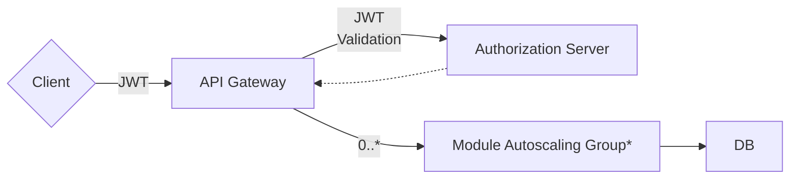
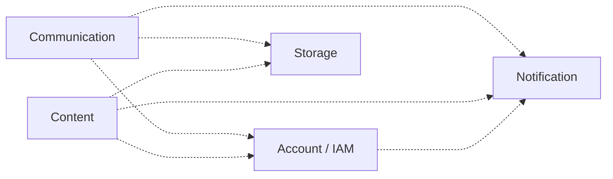

# Component Diagrams
## Overview

## Modules

## *Module Autoscaling Group

Each module is individually scalable. The actual scaling functionality depends on the actual deployment instrastructure, for example AWS ECS / EC2 or Kubernetes horizontal pod autoscaling (HPA).

Common social network modules would include:

- **Account / IAM** (Users)
- **Storage** (Files, including images and videos with streaming)
- **Content** (Posts, Comments & Reactions)
- **Communication** (Direct Messages & Group Chat)
- **Notification**

Each module connects to a standalone DB instance or standalone schema within the same DB instance.

## Source Code

> 💡 See raw Markdown above

