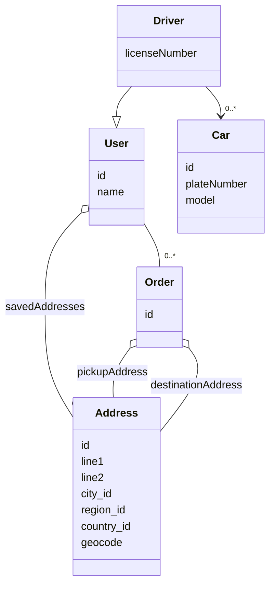

# Class Diagram

## Notes

Actual ride sharing platforms are very similar, but also might differ in various aspects. This is more of a theoretical approach that relies on the following notes and assumptions:

- Drivers might either own or otherwise be able to use multiple cars

## Source Code

> 💡 See raw Markdown above
