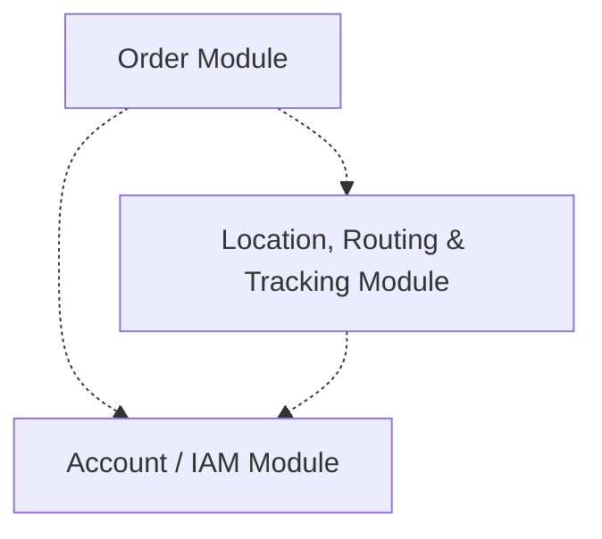

# Component Diagram
There doesn't seem to be a native component diagram syntax in Mermaid.js, but one may be *emulated* using a regular graph diagram:

> 💡 For simplicity only the high-level module components are represented

## Source Code

