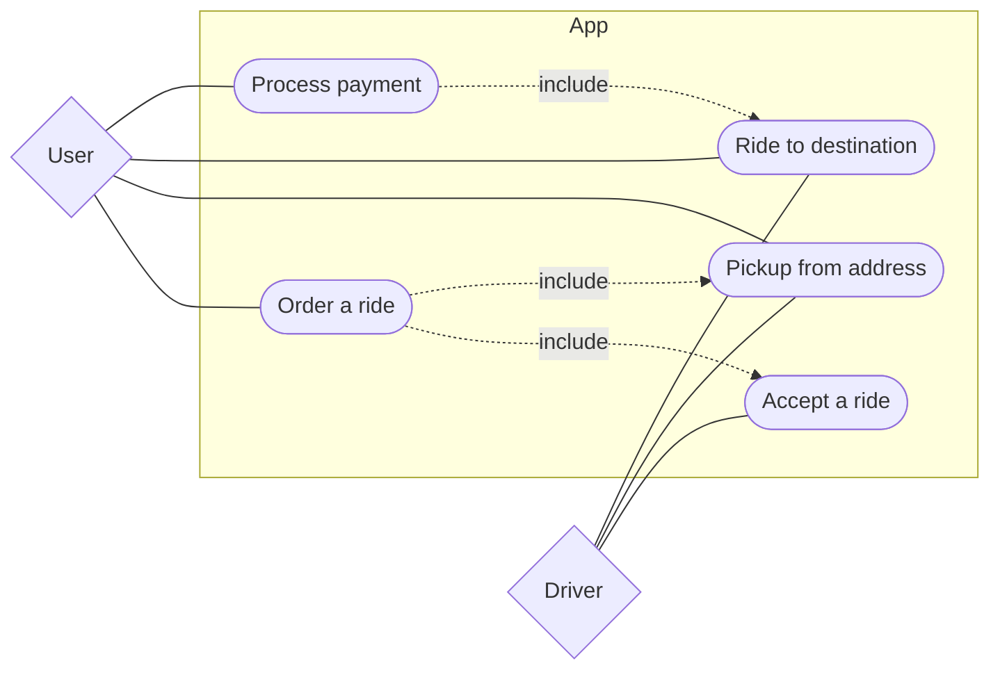

# Use Case Diagram
There doesn't seem to be a native use case diagram syntax in Mermaid.js, but one may be *emulated* using a regular graph diagram:

> 💡 Except for sequence diagrams that are quite unabiguous when it comes to layout, any text-based diagraming tool will more or less strugle to optimally and *automatically* render the graph-like layout of other diagram types. While, for example, PlantUML might accept some layout hints, Mermaid.js appears to be even less flexible and is only able to put together the unimpressive (to say the least) diagram above.

## Source Code

