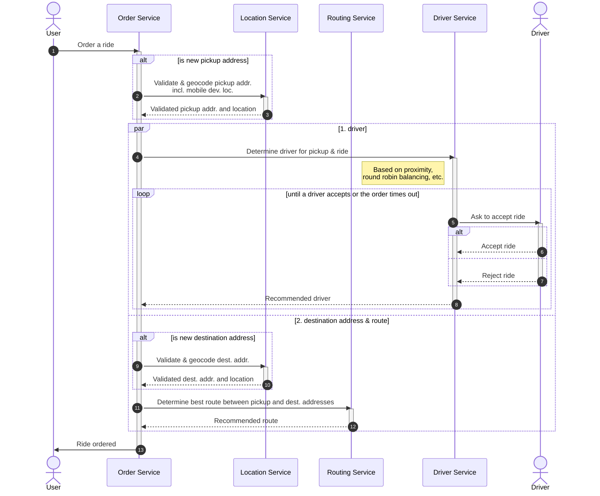

# Sequence Diagram
## Order a ride

### Notes
- For the sake of having a diverse sequence diagram, geocoding a new pickup address is performed when placing a ride order although it would usually be handled prior to that (just like with saved addresses). Geocoding (both for pickup and destination) would be cached for already saved addresses.
- For the sake of showcasing parallel execution, the destination address is validated and geocoded at the same time that a nearby driver is looked up for picking the rider

### Source Code

